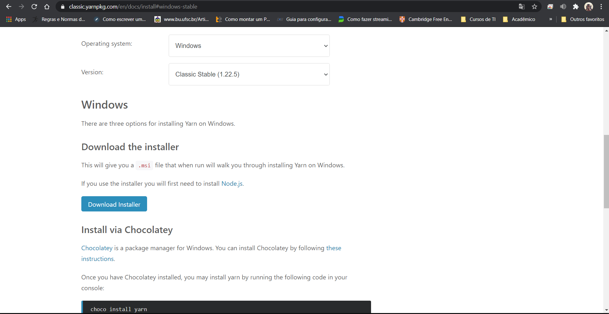
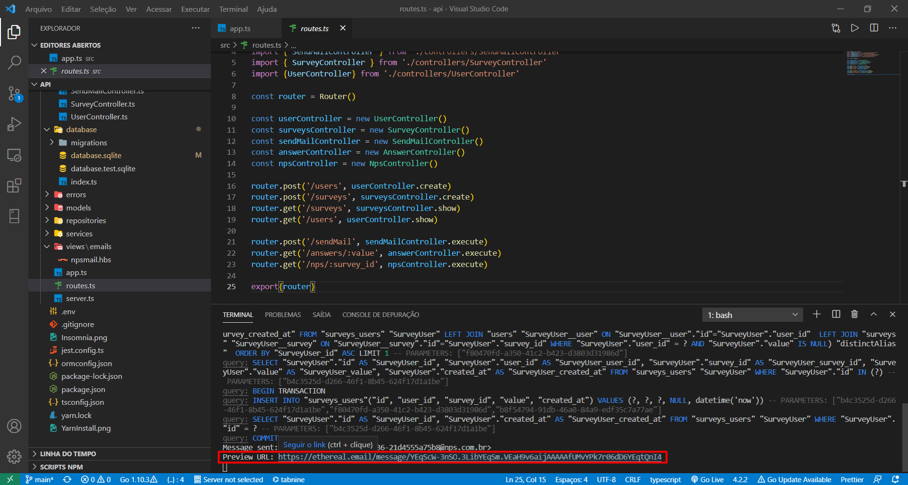
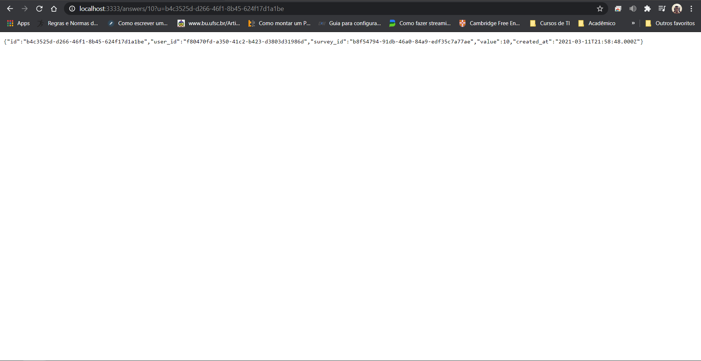
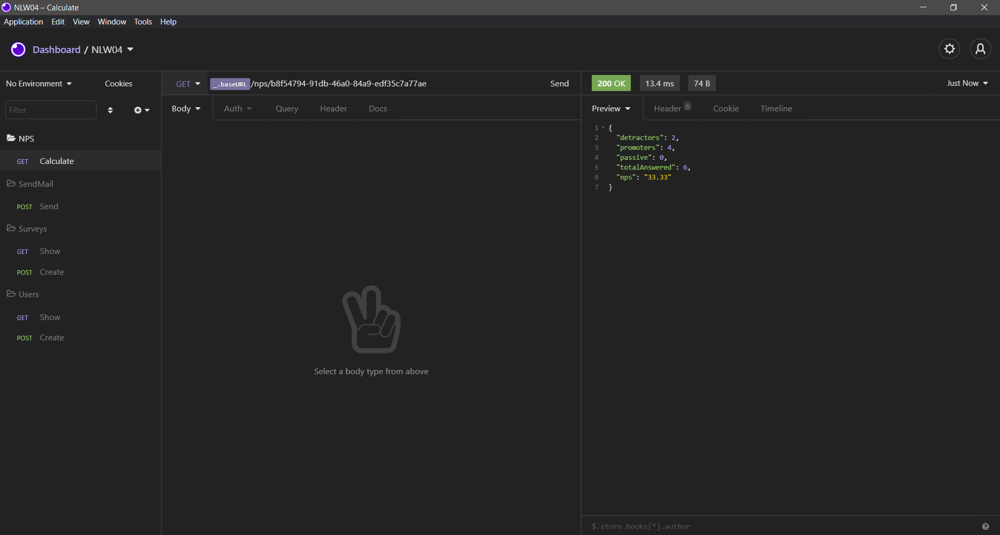

<h2>User satisfaction survey API</h2>

<p align="center">
  
  
  <a href="https://github.com/VictorMello1993/FlappyBird/commits/master">
    
  </a> 
  
  
   <a href="https://github.com/VictorMello1993/NLW-4/stargazers"></a>
</p>


<p align="center">
  <a href="#earth_americas-visão-geral">Overview</a> •
  <a href="#wrench-recursos">Features</a> •
  <a href="#triangular_flag_on_postcomeçando">Getting started</a> •  
  <a href="#gearexecutando-a-api">Running API</a> •  
  <a href="#melhorias-a-implementar">Improvements do build</a> •  
</p>

<h2>:earth_americas: Overview</h2>
<p> API built to enhance the back-end skills with Node.js during the NLW 4 event, promoted by <a href="https://rocketseat.com.br/">Rocketseat</a>. It's about an app which performs research user satisfaction survey by e-mail. 
A survey uses the concept of NPS (Net Promoter Score), the grades range from 0 to 10, and the calculus is made by the following way:</p>
  
<i>NPS = (number of promoters grades - number of detractors grades) / (total answered) * 100</i>
  
  The grades must track the following criteria:
  <ul>
    <li>Detractors grades range from 0 to 6</li>
    <li>Passive grades range from 7 to 8</li>
    <li>Promoter grades range from 9 e 10</li>
 </ul>
 
 Considering the formula, this shows users who give 7 or 8 aren't being part of survey, in order to avoid noises. Thus, the calculus normally considers with detractors or promoter grades, and the result is given as a percentage.
 
 ---
 
 <h2>:wrench: Features</h2>
<ul>
  <li>HTML</li>
  <li>CSS</li>
  <li>TypeScript</li>
  <li>NodeJs</li>
  <li>Express</li>
  <li>Handlebars (Template Engine)</li>
  <li>SQLite</li>  
  <li>Jest (Automated tests)</li>
  <li>Supertest (Integration testing tool)</li>
  <li>Nodemailer (Sending mail lib, used with Ethereal SMTP)</li>
  <li>Insomnia (Tool used to document the requests performed by API). Postman also serves.</li>
  <li>Beekeeper Studio (Database management tool)</li>
</ul>

---

<h2>:triangular_flag_on_post:Getting started</h2>


1 - Clone the repository
```
git clone https://github.com/VictorMello1993/NLW-4.git
```
2 - Open VS Code and access "api" folder as root

3 - Open the terminal and install all of dependencies available to this project
```
npm install
```
4 - Install Yarn with ```npm i -g yarn``` command or through https://classic.yarnpkg.com/en/docs/install#windows-stable clicking ```Download Installer``` button, as the images below:



If you already have yarn installed, skip this step

<br/>

5 - Run the server with ```yarn dev``` command

It's done, your app is ready to be used!

<h2>:gear:Running</h2>

1 - Open the server typing ```yarn dev``` command

2 - Open Insomnia and configure environment in ```No Environment``` -> ```Manage Environments``` typing the following JSON:
```
{
  "baseURL": "http://localhost:3333"
}
```

Then, click  ```Done```

3 - Create the folders to organize the routes by the following way: 

<ul>
  <li>NPS for GET requests that performs the NPS calculus</li>  
  <li>SendMail for POST requests that performs the sending mail with survey</li>
  <li>Surveys for GET and POST requests to query and registering surveys, respectively</li>
  <li>Users for GET and POST requests to query and registering users, respectively</li>
</ul>

Follow the image below:


4 - Run the requests on the following routes:

  4.1 - Users - ```http://localhost:3333/users``` - GET and POST requests. Then, on POST request, fill the input data on body with following JSON:

```
{
	"name": "Nome",
	"email": "Preencher e-mail válido"
}
```

  4.2 - Surveys - ```http://localhost:3333/surveys```  - GET and POST requests. Then, on POST request, fill the input data on body with following JSON:
  
```
{
	"title": "Nome do título",
	"description": "Preencher descrição"
}

```
  4.3 - Sending mail: ```http://localhost:3333/sendMail``` - POST request, where the following data must be filled:
  
```
{
	"email": "Preencher e-mail válido",
	"survey_id": "Preencher o id do survey (pesquisa) válido"
}
```

The response for the request will be a redirect link to sending a mail from Ethereal, as the images below:



</br>


</br>


<p align="center"><i> Satisfaction survey answered with 10</i></p>

</br>

  4.4 - NPS calculus: ```http://localhost:3333/nps/:survey_id``` - GET request

 

---

##  Improvements to build
- [ ] Implement an user login service with authentication and authorization with JWT (JSON Web Tokens)

---
## Versions of README
 <a href="/README-ENUS.md">English</a> |  <a href="/README.md">Portuguese</a>
