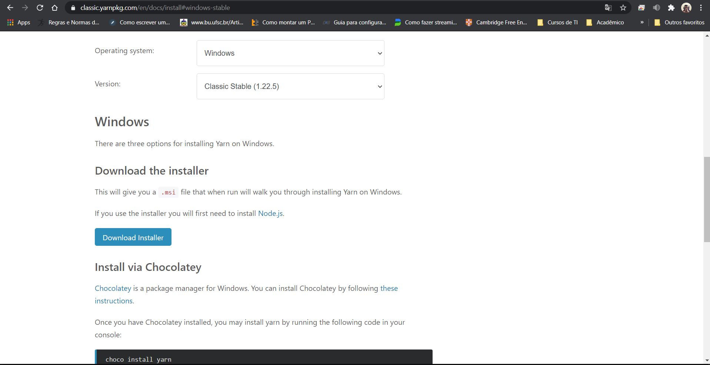
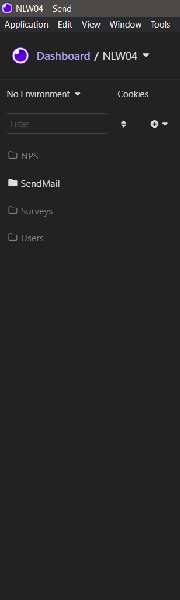
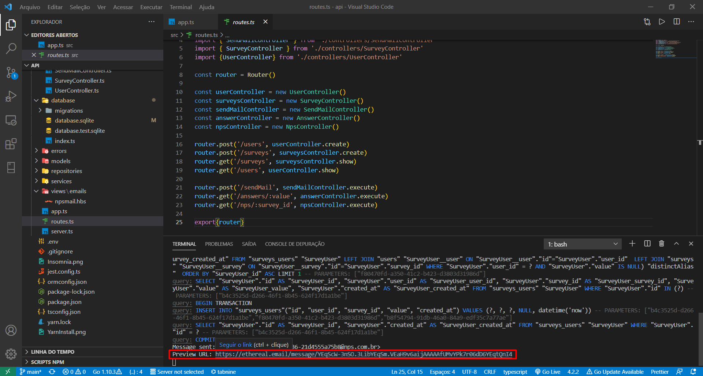
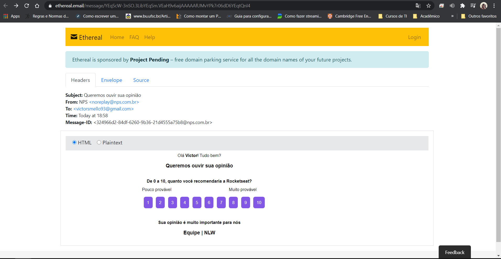
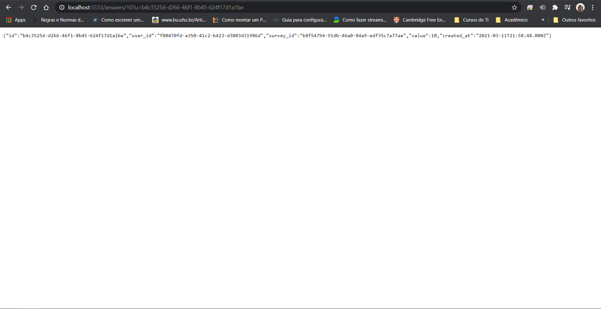
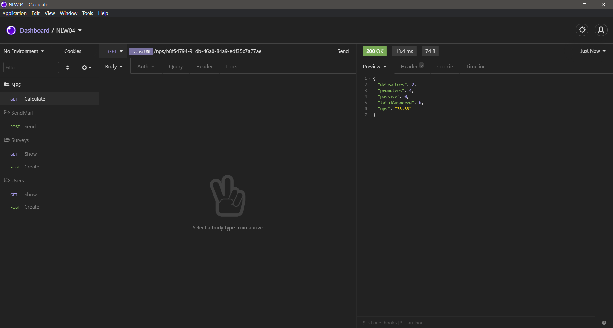

<h2>API de pesquisa de satisfação do usuário </h2>

<p align="center">
  
  
  <a href="https://github.com/VictorMello1993/FlappyBird/commits/master">
    
  </a> 
  
  
   <a href="https://github.com/VictorMello1993/NLW-4/stargazers"></a>
</p>


<p align="center">
  <a href="#earth_americas-visão-geral">Visão geral</a> •
  <a href="#wrench-recursos">Recursos</a> •
  <a href="#triangular_flag_on_postcomeçando">Começando</a> •  
  <a href="#gearexecutando-a-api">Executando a API</a> •  
  <a href="#melhorias-a-implementar">Melhorias a implementar</a> •  
</p>

<h2>:earth_americas: Visão geral</h2>
<p>API construída para reforçar os conhecimentos de back-end com Node.js durante o evento da NLW 4, promovida pela <a href="https://rocketseat.com.br/">Rocketseat</a>. Trata-se 
de uma aplicação responsável pela realização da pesquisa de satisfação do usuário via e-mail. A pesquisa utiliza o conceito de NPS (Net Promoter Score), as notas variam de 0 a 10, e o cálculo é feito da seguinte forma:
  
  <i>NPS = (nº de promotores - nº de detratores) / (nº de entrevistados) * 100</i>
  
  As notas devem seguir o seguinte critério:
  <ul>
    <li>Notas detratores variam de 0 a 6</li>
    <li>Notas passivas variam entre 7 e 8</li>
    <li>Notas promotores variam entre 9 e 10</li>
 </ul>
 
 Considerando a fórmula, isso demonstra que usuários que dão nota 7 ou 8 não estão fazendo parte da pesquisa, isso é para evitar ruídos. Portanto, normalmente o cálculo leva em consideração ou com notas detratores ou com notas promotores, e o resultado final é dado em porcentagem.
 
 ---
 
 <h2>:wrench: Recursos</h2>
<ul>
  <li>HTML</li>
  <li>CSS</li>
  <li>TypeScript</li>
  <li>NodeJs</li>
  <li>Express</li>
  <li>Handlebars (Template Engine)</li>
  <li>SQLite</li>  
  <li>Jest (testes automatizados)</li>
  <li>Supertest (ferramenta de testes de integração)</li>
  <li>Nodemailer (biblioteca de envio de e-mails, utilizado em conjunto com SMTP da Ethereal)</li>
  <li>Insomnia (ferramenta para documentar as requisições realizadas pela API). Postman também serve.</li>
  <li>Beekeeper Studio (ferramenta de gerenciamento de banco de dados)</li>
</ul>

---

<h2>:triangular_flag_on_post:Começando</h2>


1 - Clone o repositório
```
git clone https://github.com/VictorMello1993/NLW-4.git
```
2 - Abra VS Code e acesse a pasta "api" como pasta raíz da aplicação

3 - Abra o terminal e instale todas as dependências do projeto
```
npm install
```
4 - Instale o Yarn com o comando ```npm i -g yarn``` ou através do site https://classic.yarnpkg.com/en/docs/install#windows-stable clicando no botão ```Download Installer```, conforme a imagem abaixo:



Se já possui yarn instalado, pule esta etapa.

<br/>

5 - Execute o servidor com o comando ```yarn dev```

Pronto, a aplicação está pronta para ser utilizada!


<h2>:gear:Executando a API</h2>

1 - Abra o servidor digitando o comando ```yarn dev```

2 - Abra Insomnia e configure ambiente clicando em ```No Environment``` -> ```Manage Environments``` colocando o seguinte JSON:

```
{
  "baseURL": "http://localhost:3333"
}
```

Em seguida, clique em ```Done```

3 - Crie as pastas para organizar as rotas da seguinte forma:

<ul>
  <li>NPS para requisição GET responsável pelo cálculo do NPS</li>
  <li>SendMail para requisição POST responsável pelo envio de e-mail com a pesquisa</li>
  <li>Surveys para requisições GET e POST para consulta e cadastro de pesquisa, respectivamente</li>
  <li>Users para requisições GET e POST para consulta e cadastro de usuários, respectivamente</li>
</ul>

Segue abaixo a imagem:



4 - Executar as requisições nas seguintes rotas:

  4.1 - Users - ```http://localhost:3333/users``` - Requisições GET e POST. Sendo que, na requisição POST, preencher os dados de entrada no body com o seguinte JSON:

```
{
	"name": "Nome",
	"email": "Preencher e-mail válido"
}
```
  4.2 - Surveys - ```http://localhost:3333/surveys```  - Requisições GET e POST. Sendo que, na requisição POST, preencher os dados de entrada no body com o seguinte JSON:

```
{
	"title": "Nome do título",
	"description": "Preencher descrição"
}
```
  4.3 - Envio de e-mail: ```http://localhost:3333/sendMail``` - Requisição POST, onde deverão ser preenchidos os seguintes dados:
  
```
{
	"email": "Preencher e-mail válido",
	"survey_id": "Preencher o id do survey (pesquisa) válido"
}
```

A resposta da requisição será um link de redirecionamento para envio de e-mail da Ethereal, conforme as imagens abaixo:



</br>



</br>


<p align="center"><i> Resposta da pesquisa de satisfação com a nota 10.</i></p>

</br>

  4.4 - Cálculo de NPS: ```http://localhost:3333/nps/:survey_id``` - Requisição GET

 

---

##  Melhorias a implementar
- [ ] Criar um serviço de login do usuário com autenticação e autorização com JWT (JSON Web Tokens)

---
## Versões do README
 <a href="/README-ENUS.md">Inglês</a> |  <a href="/README.md">Português</a>
